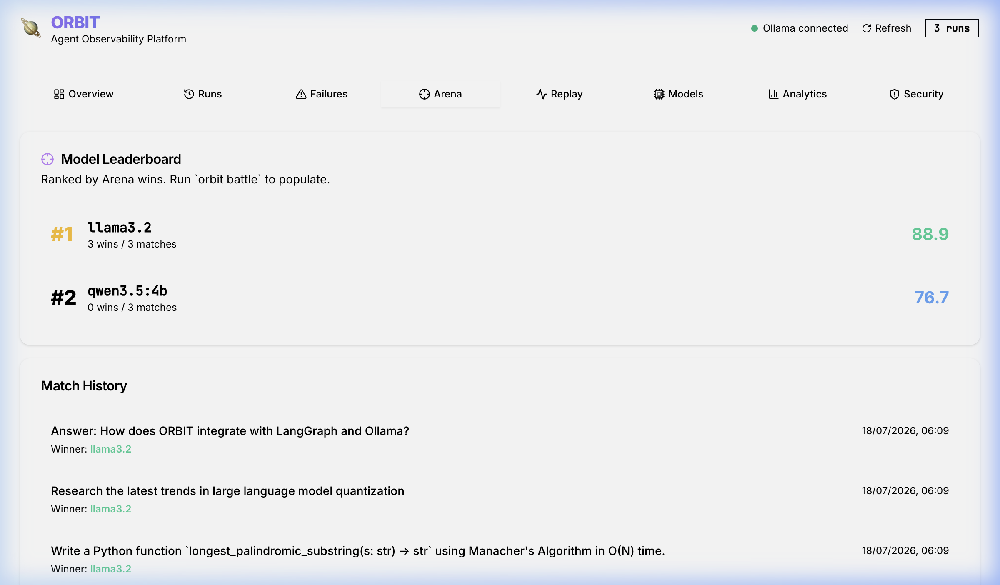
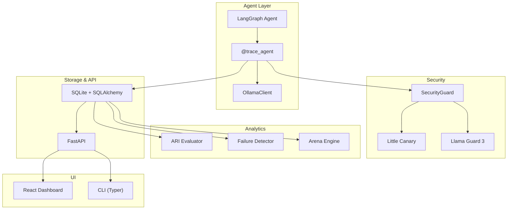

<p align="center">
  
</p>

<h1 align="center">ORBIT</h1>

<p align="center">
  Local-first observability, replay &amp; security for LangGraph agents running on Ollama
</p>

<p align="center">
  <a href="https://github.com/samvitgersappa/Orbit/actions/workflows/ci.yml">
    
  </a>
  <a href="https://github.com/samvitgersappa/Orbit/blob/main/LICENSE">
    
  </a>
  
  
  <a href="https://github.com/samvitgersappa/Orbit/stargazers">
    
  </a>
</p>

<p align="center">
  <a href="#quick-start">Quick Start</a> ·
  <a href="#features">Features</a> ·
  <a href="#architecture">Architecture</a> ·
  <a href="#cli">CLI</a> ·
  <a href="#dashboard">Dashboard</a> ·
  <a href="#contributing">Contributing</a>
</p>

---

I built ORBIT because debugging local LangGraph agents was genuinely painful. When something goes wrong — a hallucinated tool call, a silent failure, a prompt that gets injected — you're left staring at print statements.

ORBIT gives you full visibility into what your agent actually did. Every node, every LLM call, and every tool invocation is timestamped and stored locally. It also scores each run with an ARI (Agent Reliability Index), lets you replay failures step-by-step through a beautiful UI, and even lets you pit models against each other in an Arena.

We also bake in security — scanning every prompt and response for injection or unsafe content — all without sending a single byte of your data to the cloud.

It's built for Apple Silicon + Ollama, but works anywhere Python runs.

---

## Why not LangSmith / Phoenix / etc.?

Nothing wrong with those tools. But they all require an account, send your traces to a server, and cost money at scale. If you're running experiments locally, you probably don't want your prompts leaving your laptop. ORBIT keeps everything in a local SQLite file.

---

## Features

**Tracing** — wraps any LangGraph agent with a single decorator. Every node execution, tool call, LLM prompt and response gets recorded with timing.

**Dynamic Model Loading** — Our CLI is smart. If you run a trace without specifying a model, it interactively prompts you to choose one from your local Ollama instance. Don't have it? ORBIT downloads it for you on the fly.

**Failure Replay** — pick any past run and step through it one event at a time in the dashboard using our interactive Trace Stepper. Useful for understanding exactly where things went sideways.

**ARI (Agent Reliability Index)** — a 0–100 score per run, weighted across task success, tool accuracy, hallucination, and latency. Gives you a quick gut-check on whether things are improving.

**Rigorous Sandbox Testing** — ORBIT doesn't just check if your coding agent's python output parses; it injects hidden assertion suites (like edge-cases for Manacher's Algorithm) directly into the execution environment to truly test the LLM's logic.

**Agent Arena** — run the same task across multiple models and compare results side by side. Good for deciding which model is actually worth using for a given job.

**Security Guard** — every LLM call is checked for prompt injection (via Little Canary, runs locally) and unsafe content (via Llama Guard 3 through Ollama). Findings are tagged with OWASP LLM Top 10 categories.

**Dashboard** — a React app with 8 pages: Overview, Runs, Failures, Arena, Replay, Models, Analytics, Security. All wired to the local FastAPI backend.

---

## The Arena (Example Run)

Curious how different models perform? Here's an example of an Arena battle we ran between `qwen3.5:4b` and `llama3.2` across three extremely difficult 2026 reasoning tasks (Coding Manacher's Algorithm, Researching Quantization, and RAG). 

As you can see, **llama3.2 swept the board**, claiming a much higher Agent Reliability Index (ARI) due to its insanely fast latency and robust logical structuring!



---

## Quick Start

You'll need:
- macOS (Apple Silicon, tested on M4 with 16 GB RAM)
- Python 3.12+
- Node.js 20+
- [Ollama](https://ollama.com) running locally
- [uv](https://github.com/astral-sh/uv)

```bash
git clone https://github.com/samvitgersappa/Orbit.git
cd Orbit

uv sync

# pull the models you want to use
ollama pull llama3.1
ollama pull llama-guard3  # only needed for security scanning

cd frontend && npm install && cd ..
```

Start everything:

```bash
# terminal 1
uv run orbit serve

# terminal 2
cd frontend && npm run dev

# terminal 3 — trace one of the example agents (it will ask you for a model!)
uv run orbit trace src/orbit/examples/coding_agent.py
```

Open [http://localhost:5173](http://localhost:5173).

Or with Docker:

```bash
docker compose up
```

---

## Architecture



More detail in [docs/architecture.md](docs/architecture.md).

---

## CLI

```bash
orbit serve                                       # start the backend
orbit trace <path>                                # run + trace an agent script
orbit replay <run_id>                             # step through a run in the terminal
orbit battle --task "..." --models llama3.1 qwen2.5  # compare models
orbit report <run_id>                             # ARI breakdown + failure summary
orbit runs                                        # list recent runs
orbit models                                      # show available Ollama models
orbit security <run_id>                           # security events for a run
orbit security-summary                            # OWASP stats across all runs
```

---

## Dashboard

| Page | What's there |
|---|---|
| Overview | run counts, avg ARI, success rate, security alert count |
| Runs | table of all runs, click through for traces and scores |
| Failures | grouped by failure type with root cause and recommendation |
| Arena | model leaderboard and match history |
| Replay | pick a run, scrub through steps, see content at each step |
| Models | live list from Ollama |
| Analytics | latency trends, runs per model |
| Security | OWASP category chart, full event log |

---

## Tech stack

| | |
|---|---|
| Backend | Python 3.12, FastAPI, SQLAlchemy 2.0 async, SQLite, aiosqlite |
| Frontend | React 19, TypeScript, Vite, Tailwind CSS, shadcn/ui, Recharts |
| Agents | LangGraph, Ollama |
| Security | Little Canary, Llama Guard 3 |
| CLI | Typer |
| Tooling | uv, ruff, mypy, pytest, Docker, GitHub Actions |

---

## Contributing

The codebase is straightforward Python + React. If you want to hack on it:

```bash
git clone https://github.com/<your-username>/Orbit.git
cd Orbit
uv sync
cd frontend && npm install && cd ..

uv run pytest
uv run ruff check src/
uv run mypy src/
```

Things that still need work:
- more failure detectors (hallucinated tool calls, infinite loops, low-confidence answers)
- PII detection in the security module
- live replay mode (`--live` flag to actually re-execute steps)
- CrewAI / AutoGen support

Open an issue before starting anything large — good to make sure we're not duplicating effort. PRs against `main` are fine for small fixes.

See [CONTRIBUTING.md](CONTRIBUTING.md) for the full guide.

---

## License

MIT — see [LICENSE](LICENSE).
